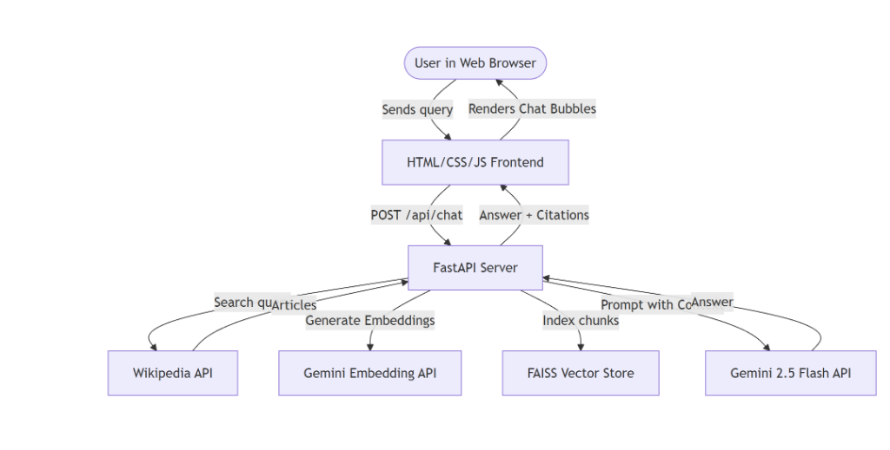

# WikiGPT - Wikipedia Conversational RAG Chatbot

WikiGPT is a full-stack, responsive, ChatGPT-style web application that implements a dynamic **Retrieval-Augmented Generation (RAG)** pipeline. It retrieves information on-the-fly from Wikipedia, indexes it in a local semantic vector store, and synthesizes accurate, cited answers using **Google Gemini 2.5 Flash**.

It includes **conversational memory** and **query reformulation** to handle follow-up questions seamlessly.

---

## 🏗️ Architecture Diagram



---

## 🌟 Key Features

*   **ChatGPT-style Interface**: A clean, modern, dark-themed responsive chat interface.
*   **Conversational Memory**: Retains the context of the chat session (up to 3 full turns), allowing it to interpret follow-up questions (e.g. asking "Who is Nikola Tesla?" followed by "when did he die?").
*   **Dynamic Query Reformulation**: Uses Gemini to rewrite vague follow-ups into specific, standalone search keywords before querying Wikipedia.
*   **On-the-Fly Ingestion**: Searches Wikipedia in real-time, splits text recursively into 3000-character chunks (with 300-char overlap), and indexes them on-the-fly.
*   **Local FAISS Vector Store**: Uses a memory-based FAISS index with Google’s `gemini-embedding-001` vectors (768-dimensions) for fast semantic search.
*   **Traceable Source Citations**: Outputs formatted responses with inline citations and clickable source badges mapping back to Wikipedia URLs.
*   **Rate-Limit Shielding**: Optimizes chunk batches to fit within a single embedding API request, completely avoiding free-tier `429 Resource Exhausted` rate-limits.
*   **Dynamic User-Agent Compliance**: Dynamically generates unique headers based on deployment hostname to comply with the Wikimedia User-Agent policy.

---

## 📁 Repository Structure

```text
├── static/
│   ├── index.html   # Main chat webpage layout
│   ├── style.css    # Clean ChatGPT-style styling
│   └── script.js    # Session state, markdown rendering, & API calls
├── app.py           # FastAPI backend & Google GenAI RAG logic
├── requirements.txt # Python dependency configuration
├── .gitignore       # Deployment safeguard for environment keys
└── README.md        # Documentation
```

---

## 🚀 Local Installation & Setup

### 1. Clone the Repository
```bash
git clone https://github.com/yourusername/WikiGPT.git
cd WikiGPT
```

### 2. Install Dependencies
Ensure you have Python 3.10+ installed:
```bash
pip install -r requirements.txt
```

### 3. Configure API Key
Create a `.env` file in the root directory:
```env
GEMINI_API_KEY=your_actual_gemini_api_key_here
```

### 4. Run the Server
Start the FastAPI server:
```bash
python app.py
```
Open **[http://127.0.0.1:8000](http://127.0.0.1:8000)** in your web browser to start chatting!

---

## ☁️ Deployment (Free on Render)

1. Create a new **Web Service** on **[Render](https://render.com/)**.
2. Connect your GitHub repository.
3. Configure the following environment settings:
    *   **Runtime**: `Python`
    *   **Build Command**: `pip install -r requirements.txt`
    *   **Start Command**: `python -m uvicorn app:app --host 0.0.0.0 --port $PORT`
4. Under **Environment Variables**, add:
    *   **`GEMINI_API_KEY`**: `your_actual_gemini_api_key_here`
5. Click **Deploy Web Service**.
